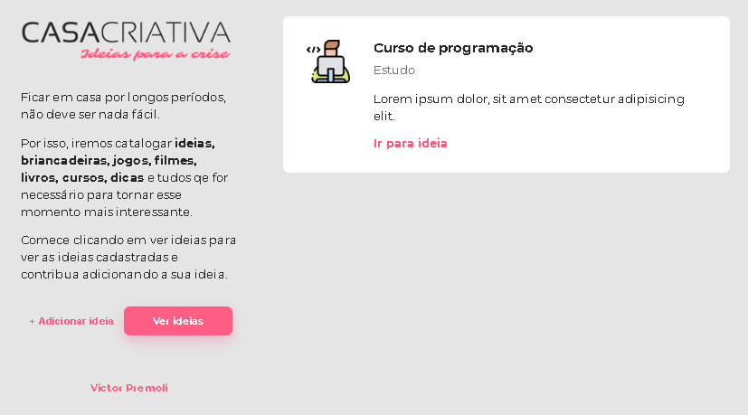
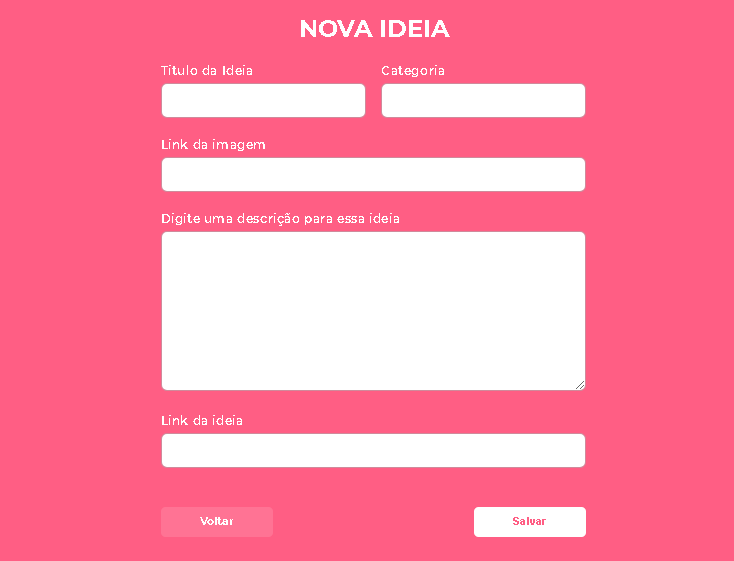
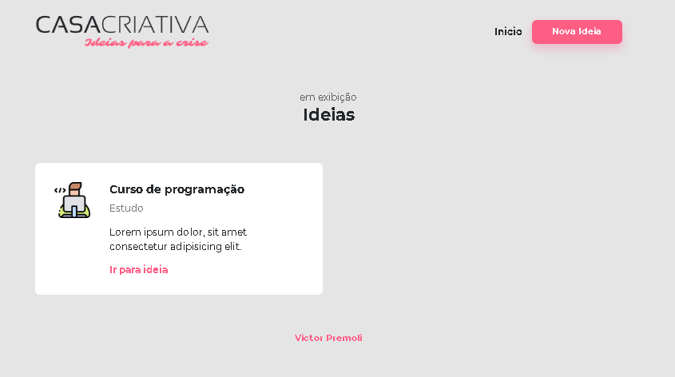

<h1 align="center">
    
</h1>

<h3 align="center">
  🚀 Workshop Dev Especial
</h3>

 

## :rocket: Tecnologias

Esse projeto foi desenvolvido com as seguintes tecnologias:

- [Node.js](https://nodejs.org/en/)
- [SQLite](https://www.sqlite.org/index.html)
- [Express](https://expressjs.com/pt-br/)
- HTML
- CSS

## 💻 Projeto

A aplicação surgiu com o objetivo de ajudar pessoas a poderem ter onde guardar suas ideias durante e depois da nova pandemia.

## 🔖 Layout

  

  

  

---

Feito por Victor Premoli [Me encontre no Linkedin!](https://www.linkedin.com/in/victorpremoli/)
